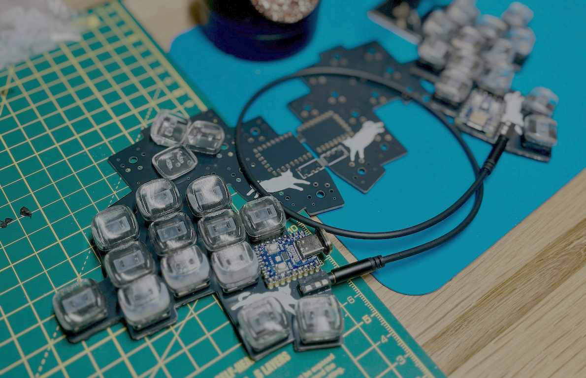

# Smallcat

A 26-key split keyboard, still featuring the purr-fect code reviewer, my cat, Lila.

This repo contains gerber files, Kicad files, my keymap, and a version of the Vial firmware for the Smallcat.

## Details

- RP2040-Zero footprint
- Low profile choc switches, soldered only
- Diodeless
- TRRS jack connector
- Splay:
  - 10° pinkie
  - 5° ring finger
  - 2° middle finger

  
## Keymap

My QMK-Vial keymap can be found [here](https://github.com/smallwat3r/vial-keymap).

