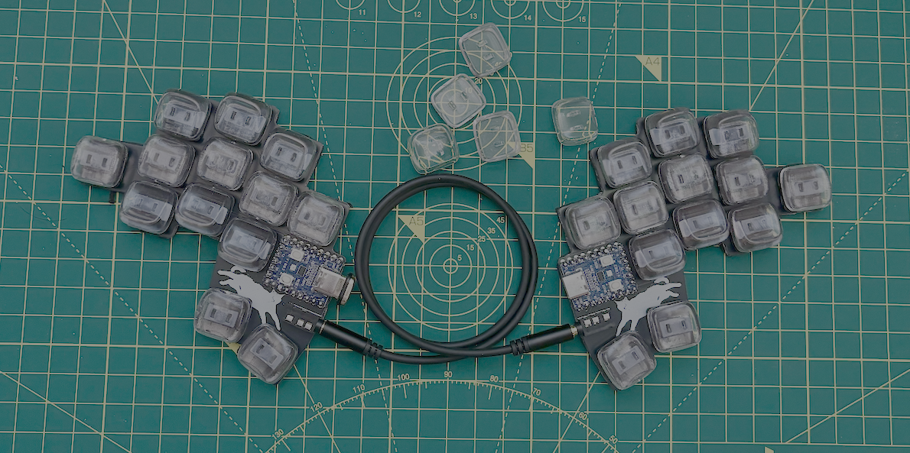
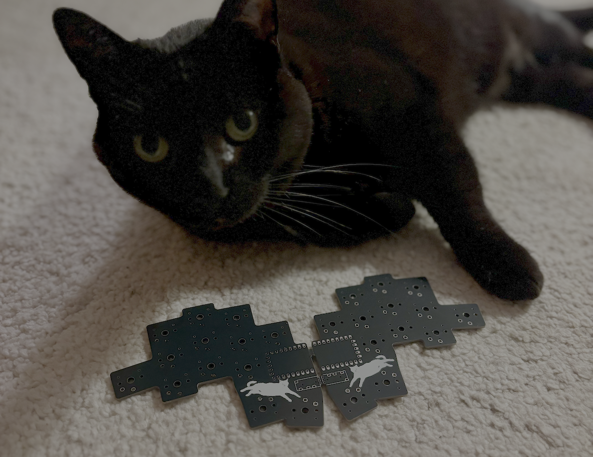

# Smallcat

A 26-key split keyboard, still featuring the purr-fect code reviewer, my cat, Lila.

This repo contains gerber files, Kicad files, my keymap, and links to a QMK and Vial-QMK firmware version for the Smallcat.

## Details

- RP2040-Zero footprint
- Low profile choc switches, soldered only
- Diodeless
- TRRS jack connector
- Splay: 
  - 10° pinkie
  - 5° ring finger
  - 2° middle finger
  

## Case

Smallcat has a no-screw case. The base of the case is 1mm larger than the PCB, which allows
for it to slide right in without the need for screws to hold it. I've placed 
little bumptons under the PCB in order for the pins to not sit directly against 
the case.

## Keymap 

## Firmware

### for QMK

I maintain my own [QMK keymap](https://github.com/smallwat3r/qmk-keymap), from where you can 
find my QMK configuration and keymap for the Smallcat. It also contains a ready to use UF2
file with my QMK keymap flashed.

### for QMK-Vial

Here is my old [Vial keymap](https://github.com/smallwat3r/vial-keymap) configuration, that
also includes a UF2 file flashed with Vial.

Else, you can find the source configuration files for Vial from the 
[Vial repository](https://github.com/vial-kb/vial-qmk/tree/vial/keyboards/smallcat).

