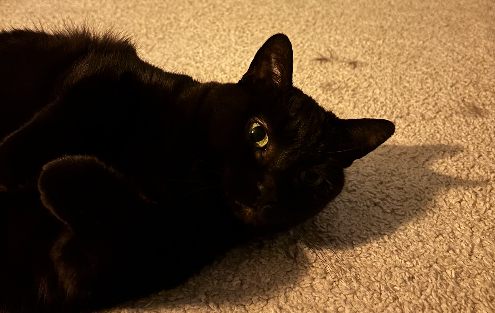
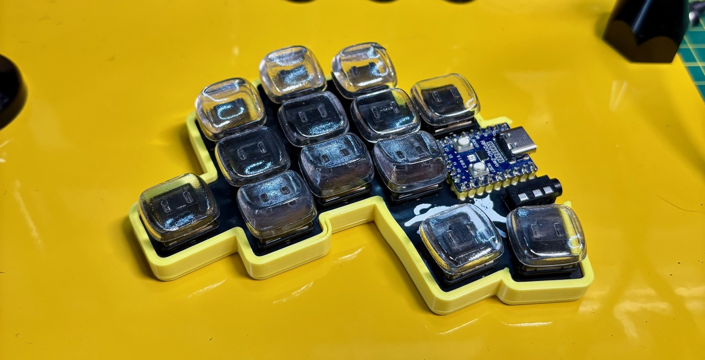
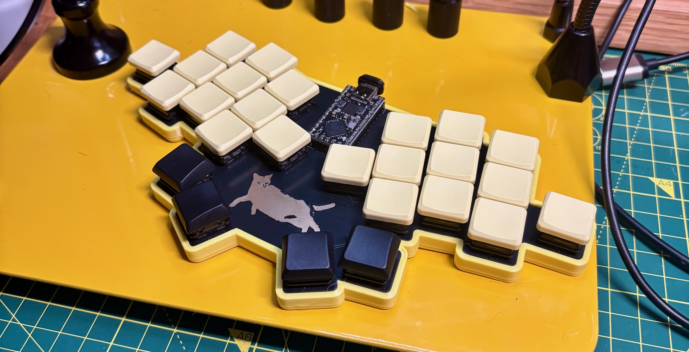

# Smallcat

A diodeless 26-key keyboard, featuring the purr-fect code reviewer, my cat, Lila.

This repo contains Gerber files, KiCad files, my keymap, and links to QMK and Vial-QMK firmware for the Smallcat.

## Versions

There are two versions of the Smallcat: **split** and **unibody**.

Both versions share the same column splay:

| Finger | Splay |
|--------|-------|
| Pinkie | 10°   |
| Ring   | 5°    |
| Middle | 2°    |

### Split

| Component | Specification |
|-----------|---------------|
| Controller | 2x RP2040-Zero footprint ([example](https://www.waveshare.com/wiki/RP2040-Zero)) |
| Switches | 26 low profile Choc (soldered) |
| Diodes | None required |
| Connection | TRRS jack |

### Unibody

| Component | Specification |
|-----------|---------------|
| Controller | 1x RP2040 Pro Micro with 28 I/O pins ([example](https://www.aliexpress.com/i/1005006097129434.html)) |
| Switches | 26 low profile Choc (soldered) |
| Diodes | None required |

#### Build notes

The unibody version has a few unconventional details:

- **Pro Micro model**: Use a Pro Micro with extra pins (18 and 24) near the middle of the board.

- **Pin clearance**: The space between pins 18 and 24 is narrow. You may need to trim the plastic between them, just ensure enough remains so the metal contacts don't touch. [See photo](./assets/pins_uni.png). This is a simple workaround to use the extra pins and keep the board diodeless.

- **Pin headers**: PCB holes are narrower than standard. Use machined conical pin headers like [these](https://www.proto-advantage.com/store/datasheets/MPH100IMP40M-G-V-TH.pdf).

- **Controller orientation**: Install component-side up (not face-down like most keyboards). This way the boot and reset buttons are accessible.

## Case

Simple press-fit cases with no screws or hardware. The base is 1mm larger than the PCB, allowing it to slide in snugly. You may need to trim some edges slightly to ensure a tight fit. Small bumpons under the PCB prevent the pins from resting directly on the case.

| Split | Uni |
|-------|-----|
|  |  |

## Firmware

I maintain my own [QMK keymap](https://github.com/smallwat3r/qmk-keymap), which includes my keymap, configuration for the Smallcat, and a ready-to-flash UF2 file.
